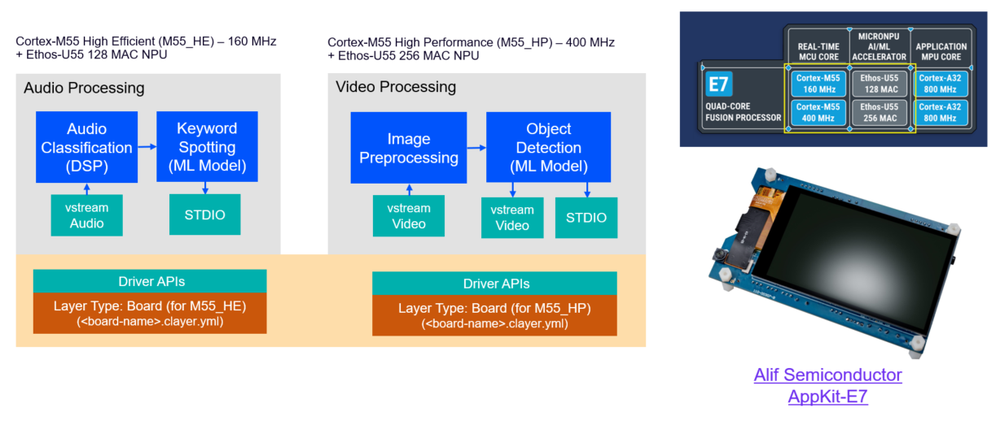
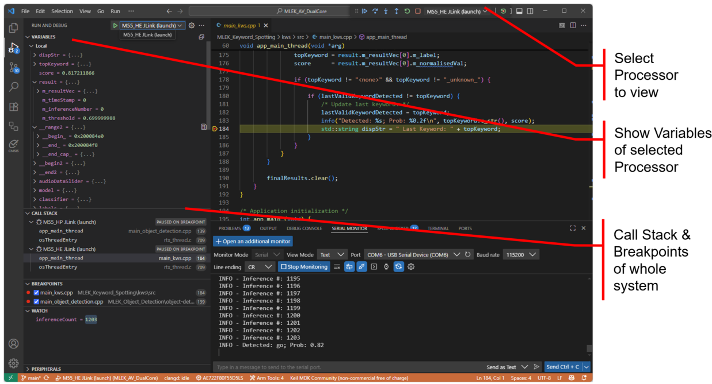

# Dual-Core Example for Alif Semiconductor AppKit E7/D3

> TIP: [Webinar 3: ML and Dual-Core Debugging on Alif Ensemble E7](https://www.arm.com/resources/webinar/keil-studio) explains this example.

## JLink

When using the JLink debug adapter ensure that JLink version 8.44 or higher is installed.
The JTAG/SWO clock speed is configured to 5MHz, as the default 'auto' setting may have communication issues.
This is already configured in the `.vscode\launch.json` file.

## SETOOLS

Before using this example on the AppKit E7 board it is required to program the ATOC of the device
using the Alif SETOOLS.

Refer to the section [Usage](https://github.com/alifsemi/alif_ensemble-cmsis-dfp/blob/main/docs/Overview.md)
in the overview page of the Alif Semiconductor Ensemble DFP/BSP for information on how
to setup these tools.

In VS Code use the menu command **Terminal - Run Tasks** and execute:

- "Alif: Install M55_HE and M55_HP debug stubs (dual core configuration)"

> Note:
>
> - Configure J15-A & J15-B to position SE (Secure UART) to enable SETOOLS communication with the device.
> - Configure J15-A & J15-B to position U4 (UART4) to show the output of the Keyword Spotting application.

## Operation

The example combines two [Machine Learning Evaluation Kit (MLEK)](https://www.keil.arm.com/packs/cmsis-mlek-arm) applications:

- The Audio Keyword Spotting application executes on the Cortex-M55/Ethos-U55 High Efficiency core. The inference result is output over the serial port.
- The Video Object Detection application executes on the Cortex-M55/Ethos-U55 High Performance core. The inference result is shown on the display.

## Multi-core Debugging

Use [Keil Studio for VSCode](https://www.keil.arm.com/) that supports multi-core debugging as shown below.

